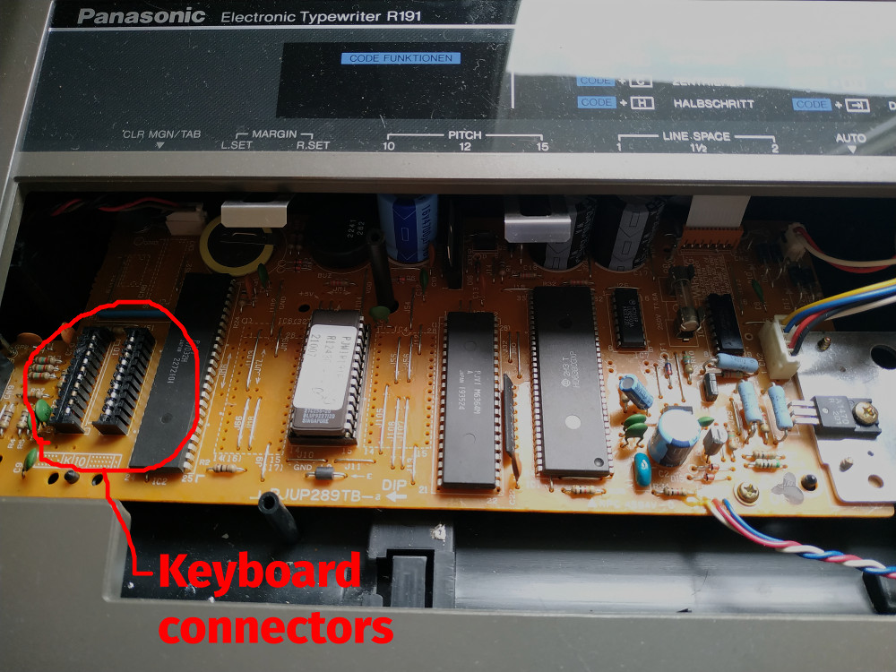
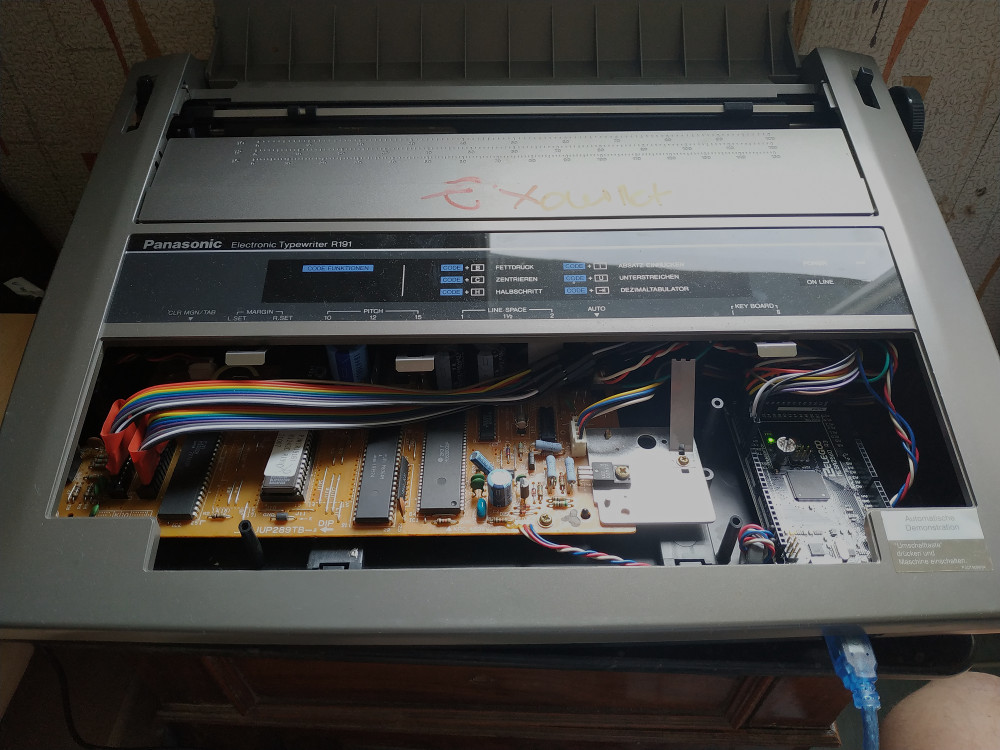

# Typewriter Arduino project

## Introduction

The project aims to transform a Panasonic KX-R191 electronic typewriter into a printer, i.e.
make possible to control it from a computer.

For simplicity reason, printing is done via serial over USB on the arduino.

Arduino code handles the control of the typewriter, and `print.py` is a small python program
to prepare for printing and sending correct data over the serial line.

## Hack description

The typewriter is an old Panasonic KX-R191, you can see photos and information on https://typewriterdatabase.com/198x-panasonic-kxr191.2355.typewriter.


These models have an external ports to act as a printer but you need an external converter (a Panasonic KX-R60) that is now
unobtainable. And even with the converter, it still need a LPT1 connector, with correct drivers, so very little chance to work.

On the circuit board of the typewriter, we can find some microcontroller and other components, but nothing easy to understand
without schematics and code. 



So I decided (well, being very much helped by this hack description for another typewriter: https://hackaday.io/project/18506/instructions)
to emulate keyboard.

### The keyboard

They are 2 keyboards connectors, each with 10 pins. A keyboard is basically a matrix of switches. To test it for example,
by jumping pin 4 from left connector to pin 0 of right connector, the typewriter will print an 'e' (and repeat if you leave to
jumper wire).

So first thing to do is to map all the key to their corresponding pins couple. To do that, it could be as simple
as using the continuity tester function of a multimeter, connecting it to one pin of each connector then trying all key
until it beeps.

At the end, we got this marvelous table for the KX-R191

```
+-----+-----+-------+-----------+-----+----------+-----+-----+-------+-------+----------------+
| R\L |  0  |   1   |     2     |  3  |    4     |  5  |  6  |   7   |   8   |       9        |
+-----+-----+-------+-----------+-----+----------+-----+-----+-------+-------+----------------+
|   0 | 1   | 2     | r         | e   | g        | h   |     | #     |       |                |
|   1 | ⇼   |       | q         | w   | f        | d   |     | b     | n     |                |
|   2 | 4   | 3     | t         | z   | k        | j   |     | ,     | m     |                |
|   3 | 5   | 6     | Tab       |     | a        | s   |     | v     | c     | Space          |
|   4 |                                      GND                                              |
|   5 |                                  CAPS LOCK LED                                        |
|   6 | 8   | 7     | i         | u   | l        | ö   |     | .     | -     | Tab+           |
|   7 | 9   | 0     | o         | p   | CapsLock |     |     | y     | x     | Code           |
|   8 | ´   | ß     | +         | ü   | Return   | ä   |     | Shift |       | QuickEraseLine |
|   9 | ←   | Print | Backspace |     |          |     |     |       | Reloc | ↨              |
+-----+-----+-------+-----------+-----+----------+-----+-----+-------+-------+----------------+
```

For now on, I may refer to the left connector as the "column" connector, and the right connector as the "row" connector.

### Emulating the keyboard

Once mapping is known, we got to emulate keyboard with all the connector pins. The principle for guessing which keys
are pressed is that the typewriter will sequencially "select" a column and "look" if any row is enabled.

Electronically speaking, all pins from left connectors will be sequencially (in decreasing order) temporary pulled down for 200µs and if one
(or more) pin of the right is also pulled down, it means that the key is pressed. 

So on the arduino side (function `void activate(...)`), if we want for example to print an 'e' (row 0, col 3), we have to wait that pin 3 of left
connector is down, then we set pin 0 of right connector to `LOW` until pin 3 is `HIGH` again, 
then we set pin 0 of right to `HIGH` again (else the typewriter will think that we've also pressed an 'r').

`activate` function have a special case for letters that are on the same column as shift as they are the only valid case of two keys
of the same column pressed together (the only other modifier key is Code and has no valid "partner" key in its column).

### Arduino code

The Arduino code contains the mapping table, with the symbols coded via their ISO-8859-1 decimal code (and thus their Unicode codepoint). It reads the characters from the  serial line. For now it reads every bytes and map it so it supports ISO-8859-1 encoding on the serial port.

Once it has found the caracter, it will apply its "modifier" (i.e. shift/code, but also dead keys such as accents), then the character itself via `activate` (actually `activate` is called two times to support 2 cycles, for better detection).

A very basic flow control is implemented: once the buffer is empty, the arduino will send 
a '.' over the serial line.

### Python code

The python `print.py` is the computer-side of the project. It handles multiple things:
 
 - Initialize serial connection with correct parameters
 - Handle flow control mechanism
 - Encode to ISO-8859-1
 - Wrap text to 70 columns for correct margin on A4 with pitch
 - Has a "typewriter" mode to control the printer, set margin, page feed, ...


### What it looks like at the end



## Utilisation

### Arduino

Use an arduino with enough digital pins such as the Arduino Mega 2560. 
 - Connect all the 10 pins of the left connector to the arduino (although the 6 is useless and can be omited)
 - Connect all the pins *except* 5 (caps lock led) and 4 (connect it the the ground) to the arduino

Set the correct pin mapping in the `get_col_pin` and `get_row_pin` function of the code.

Then `make && make upload` and you're in business.

### Python

The only requirements for python is `pyserial`, install it system-wide or in a virtualenv.

Then run `python3 print.py --help` to see all options.


